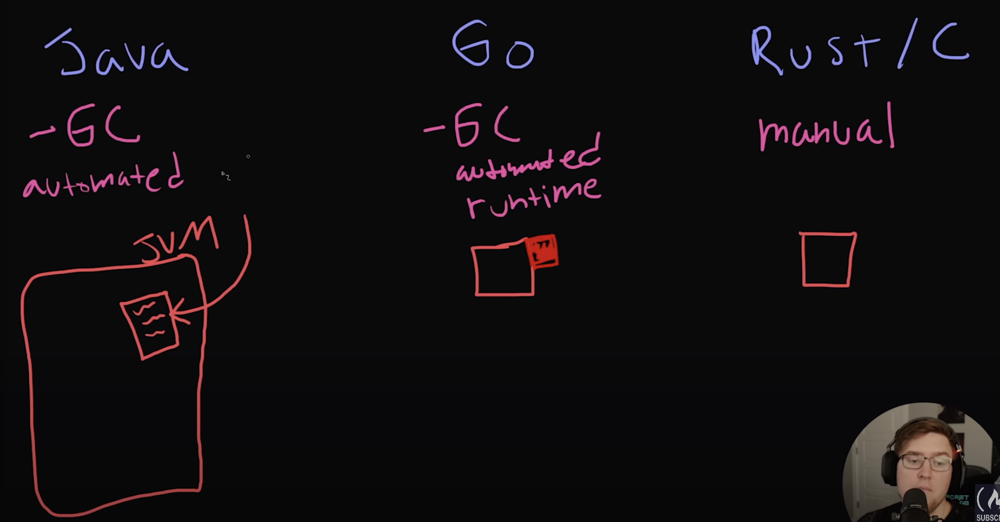

# Links
- [Go Official Tutorial](https://go.dev/tour/welcome/1)
- [Free Code Camp Go Course](https://www.youtube.com/watch?v=un6ZyFkqFKo)

# General Notes
## Compilation & Runtime
- Go has a automated runtime that is run along with the binary that Go produces. 
  - this runtime handles memory mangagement (cleanup unused memory)

## Packages
**Packages**
- Every Go program is made up of packages
- Programs start running in package main
- by convention, package name is the same as the last element of the import path ("math/rand" package comprises files that begin with the statmement "package rand")
- `package main` is a special package with an entrypoint at the `main()` function. 

**Library Packages**
- A package by any name other than `main` is a "library package", and these have no entry point. They simply export functionality that can be used by other packages.
- Packages live at the directory level, so don't need to import or export code between files in the same directory

**Repository**
- Module: A releasable collection of Go packages
- Repository: Typically contains only one module, located at the root of the repository
  - go.mod declares the module

**Imports**
- multiline or "factored" import statement

**Exported Names**
- a name is exported if it begins with a capital letter
- when importing a package, you can refer only to its exported names

**The GOPATH**
- Recommended way is now not to put your code in the GOPATH. No longer relevant.

**Clean Packages**
1. Hide internal Logic
2. Don't Change APIs 
3. Don't export functions from the main package
4. Packages shouldn't know about dependents: a package should never have specific knowledge about a particular application that uses it.


## Build & Run
```sh
go build && ./<executable_name>
```

**Runnable Go Scripts**
- Run `go install` to be able to run my package/script as a command in the shell from anywhere. Useful when wanting to make my own scripts with go. 


## Go Fmt
Automatically format your code according to gofmt standard. Two ways:
```sh
gofmt -w yourcode.go
```
```sh
go fmt path/to/your/package
```


# Built-In Package
## Variables
**Basics**
- "var" statement declares a list of variables; the type is last
	- can be at package or function level
- Variable declarations:
	- Var declaration with initializers mean type can be omitted
	- ":=" short assignment statement: inside a function, can be used in place of "var" declaration with implicit type
- Uninitialized variable values: 0, false, empty string

**Basic Types**
```
bool

string

int  int8  int16  int32  int64
uint uint8 uint16 uint32 uint64 uintptr

byte // alias for uint8

rune // alias for int32 (uses int32 under the hood)
     // represents a Unicode code point (aka a character)

float32 float64

complex64 complex128
```
int, unit, and uintptr types are usually 64 bits wide on 64-bit systems
- `T(v)` converts the value `v` to type `T`
- Unlike C, in God assignments between items of different type requires an explicit conversion 

**Constants**
- `const` keyword
- cannot use `:=` syntax
- Numeric constants do not take a specific numeric type, but rather takes the type needed by its context
```go
const ENV_FILE = ".env"
```

**Pointers**
- The type `*T` is a pointer to a `T` value. Its zero value is `nil`
```go
var p *int
```
- The `&` operator generates a pointer to its operand
```go
i := 42
p = &i
```
- The `*` operator denotes the pointer's underlying value (dereferncing, indirecting)
```go
fmt.Println(*p) // read i through the pointer p
*p = 21         // set i through the pointer p
```
- NOTE: unlike C, Go has no pointer arithmetic

## Functions
**Functions**
- type comes after the variable name
- When two or more consecutive named funciton parameters share a type, you can omit the type from all but the last "x int, y int" -> "x, y int"
- Can return any number of results
- Can ignore some of the returned values:
```go
x, _ := getPoint()
```
- Named return values:
	- Return values may be named. If so, they are treated as variables defined at the top of the function. This gives more information to the caller of the function
  ```go
  func getCoords() (x, y int){
    // x and y are initialized with zero values
    return // automatically returns x and y ("naked return")
  }
  ```
  - "naked" return: a return statement without arguments: returns the named return values. Advised against


## Flow Control
**For**
- no parentheses, and braces are always required
```go
for i := 0; i < 10; i++ {
  sum += i
}
```
- init and post statements are optional
```go
for ; sum < 1000; {
  sum += sum
}
```

**While**
```go
for sum < 1000 {
  sum += sum
}
```

**Inf. Loop**
```go
for {
}
```

**If**
- parentheses not needed, braces required
```go
if x < 0 {
  ...
}
```
- Like `for`, the `if` statement can start with a short statement to execute before the condition
```go
if v := math.Pow(x, n); v < lim {
	return v
}
```

**Switch**
- In Go, only the selected case is run, not all the cases that follow (`break` statement is not needed)
- switches cases need not be constants, and values involved need not be integers
```go
switch os := runtime.GOOS; os {
case "darwin":
  fmt.Println("OS X.")
case "linux":
  fmt.Println("Linux.")
default:
  // freebsd, openbsd,
  // plan9, windows...
  fmt.Printf("%s.\n", os)
}
```
- evaluated top to bottom, stopping when a case succeeds
- switch without a condition is same as `switch true`, useful to write long if-then-else chains
```go
t := time.Now()
switch {
case t.Hour() < 12:
  fmt.Println("Good morning!")
case t.Hour() < 17:
  fmt.Println("Good afternoon.")
default:
  fmt.Println("Good evening.")
}
```

**Range**
- `range` form of the for loop iterates over a slice or map
```go
for index, value := range mySlice {
  // Use index and value (a copy of the element)
}
```
- Also valid:
```go
for idx := range pow
for _, value := range pow
```

## Structs
**Overview**
- a collection of fields
```go
type Vertex struct {
  X, Y int
  Z string
}

func main() {
  fmt.Println(Vertex{1, 2})
}
```
- fields are accessed using a dot (only fields starting with a capital letter can be accessed outside of this package)
```go
v := Vertex{1, 2}
v.X = 4
fmt.Println(v.X)
```
- Pointers to structs: To access the field `X` of a struct when we have the struct pointer `p` we can write `(*p).X`, or just simply `p.X` also works.
- Initialization: 
```go
p := Person{
  FirstName: "John",
  Age:       30,
}
```
**Anonymous struct**
- Can only be used once
```go
myCar := struct {
  Make string
  Model string
} {
  Make: "tesla",
  Model: "model 3"
}
```
**Embedded struct**
- Way to get data-only inheritance from a parent struct. (really just syntantic sugar for copying over fields)
```go
type car struct {
  make string
  model string
}

type truck struct {
  // "car" is embedded, so the definition of a
  // "truck" now also additionally contains all
  // of the fields of the car struct
  car
  bedSize int
}
```

**Methods on Structs**
```go
type rect struct {
  width int
  height int
}

// area has a receiver of (r rect)
func (r rect) area() int {
  return r.width * r.height
}

r := rect{
  width: 5,
  height: 10,
}

fmt.Println(r.area())
// prints 50
```
**Struct Methods That Modify the Struct**
Need to use *pointer receiver* to modify the struct
```go
type car struct {
	color string
}

func (c *car) setColor(color string) {
	c.color = color
}

func main() {
	c := car{
		color: "white",
	}
	c.setColor("blue")
	fmt.Println(c.color)
	// prints "blue"
}
```
Note, `c` is automatically cast to a pointer in this code

**Struct Tags**
- a string literal associated with a struct field. Provides additional metadata about the field
- ex:
```go
type myStruct struct {
  ItemsTableName string `yaml:"ItemsTableName"`
}
```
this specifies that when this struct is serialized to or deserialized from YAML format, the field should be represented as `ItemsTableName` (basically tells the decoder that this variable in Go should be assigned the value of `ItemsTableName` in the YAML file)

## Interfaces
**Overview:** a collection of method signatures. A type "implements" an interface if it has all of the methods of the given interface defined on it.
```go
type shape interface {
  area() float64
  perimeter() float64
}

type rect struct {
    width, height float64
}
func (r rect) area() float64 {
    return r.width * r.height
}
func (r rect) perimeter() float64 {
    return 2*r.width + 2*r.height
}
```
Result: `rect` can be used as a `shape` type

**Type Assertions**
```go
type shape interface {
	area() float64
}

type circle struct {
	radius float64
}

// "c" is a new circle cast from "s"
// which is an instance of a shape.
// "ok" is a bool that is true if s was a circle
// or false if s isn't a circle
c, ok := s.(circle)
```

**Type Switch**
```go
func printNumericValue(num interface{}) {
	switch v := num.(type) {
	case int:
		fmt.Printf("%T\n", v)
	case string:
		fmt.Printf("%T\n", v)
	default:
		fmt.Printf("%T\n", v)
	}
}

func main() {
	printNumericValue(1)
	// prints "int"

	printNumericValue("1")
	// prints "string"

	printNumericValue(struct{}{})
	// prints "struct {}"
}
```

**Good practices**
- Clean: keep interfaces as small as possible
- Should not make interfaces aware of the underlying type
- Interfaces are not classes! They are much simpler.


## Errors
**Overview**
- express errors with `error` values. An `Error` is any type that implements the simple built-in error interface:
```go
type error interface {
    Error() string
}
```

**Handling Errors**
- When something can go wrong in a function, that function should return an `error` as its last return value. Any code that calls a function that can return an `error` should handle errors by testing whether the error is `nil`.
```go
func myFunc() (int, error) { ... }

func main() {
  i, err := myFunc()
  if err != nil {
    fmt.Println(err)
    return
  }
  // success
}
```

**Custom Errors**
```go
type userError struct {
  name string
}

func (e userError) Error() string {
  return fmt.Sprintf("%v has a problem with their account", e.name)
}

// Use Custom Error
func sendSMS(msg, userName string) error {
  if !canSendToUser(userName) {
      return userError{name: userName}
  }
  ...
}
```

**The Errors Package**
- The Go standard library provides an "errors" package that makes it easy to deal with errors.
- `import "errors"`
- Example with `errors.New()`:
```go
var err error = errors.New("something went wrong")
```


## Arrays & Slices
**Arrays**
- The type `[n]T` is an array of `n` values of type `T`
- Arrays cannot be resized

**Slices**
- A slice is a dynamically-sized, flexible view into the elemtns of an array
- The type `[]T` is a slice with elements of type `T`
- slice is formed by specifying two indices, a low and high bound (inclusive, exclusive)
```go
primes := [6]int{2, 3, 5, 7, 11, 13}
var s []int = primes[1:4]
```
- slices are like references to arrays, not storing any data itself. Modifying a slice changes the actual array & also any slices that point to it.
- initialize a slice with a slice literal. It creates the array & then builds a slice that references it:
```go
numbers := []int{1, 2, 3}
```
- when omit high or low bounds, it uses the defaults instead (0 & the length of the array): `a[0:]`
- Slice length: # elements it contains
- Slice capacity: the number of elemetns in the underlying array, counting from the first element in the slice: `len(s)` & `cap(s)`
- The zero value of a slice is `nil`, with length and capacity of 0 & no underlying array
- slices can be created with the built-in `make` function (this is how you create dynamically-sized arrays)
  - the `make` function allocates a zeroed array and returns a slice that refers to that array:
  ```go
  a := make([]int, 5)  // len(a)=5, cap(a)=5

  // to specify different len & capacity
  b := make([]int, 0, 5) // len(b)=0, cap(b)=5

  b = b[:cap(b)] // len(b)=5, cap(b)=5
  b = b[1:]      // len(b)=4, cap(b)=4
  ```
- can contain any type, including other slices
- Appending to a slice:
  - append the items to the passed in slice, returning a new slice
  - if the backing array of s is too small to fit all the given values, a bigger array is allocated which the returned slice points to
  - append another slice:
  ```go
  slice = append(slice, anotherSlice...)
  ```
- copy: copies data from a source slice to a destination slice
  ```go
  func copy(dst, src []T) int
  ```

## Maps
```go
ages := make(map[string]int)
ages["John"] = 37
ages["Mary"] = 24
ages["Mary"] = 21 // overwrites 24
```

```go
ages = map[string]int{
  "John": 37,
  "Mary": 21,
}
fmt.Println(len(ages)) // 2 
```

**Mutations**

Insert an element:
```go
m[key] = elem
```
Get an element:
```go
elem = m[key]
```
Delete an element:
```go
delete(m, key)
```
Check if a key exists:
```go
elem, ok := m[key]
```

**Nested Map Alternative: Struct Key**
- Nested maps can be messy, use a struct as a key for multiple keys
```go
type Key struct {
    Path, Country string
}
hits := make(map[Key]int)
```

When a Vietnamese person visits the home page, incrementing (and possibly creating) the appropriate counter is a one-liner:

```go
hits[Key{"/", "vn"}]++
```

And it’s similarly straightforward to see how many Swiss people have read the spec:

```go
n := hits[Key{"/ref/spec", "ch"}]
```

### Interface Type List
We can now simply list a bunch of types to get a new interface/constraint.

```go
// Ordered is a type constraint that matches any ordered type.
// An ordered type is one that supports the <, <=, >, and >= operators.
type Ordered interface {
    ~int | ~int8 | ~int16 | ~int32 | ~int64 |
        ~uint | ~uint8 | ~uint16 | ~uint32 | ~uint64 | ~uintptr |
        ~float32 | ~float64 |
        ~string
}
```

### Parametric Constraints
```go
// The store interface represents a store that sells products.
// It takes a type parameter P that represents the type of products the store sells.
type store[P product] interface {
	Sell(P)
}

type product interface {
	Price() float64
	Name() string
}
```


# Concepts
## References vs Value
- Structs are passed by value
- Slices & Maps hold references, meaning they are passed by reference
## First Class Functions
### Function Currying
The practice of writing a function that takes a function (or functions) as input, and returns a new function. Basically maps a function to a new function.
```go
func main() {
  squareFunc := selfMath(multiply)
  doubleFunc := selfMath(add)
  
  fmt.Println(squareFunc(5))
  // prints 25

  fmt.Println(doubleFunc(5))
  // prints 10
}

func multiply(x, y int) int {
  return x * y
}

func add(x, y int) int {
  return x + y
}

func selfMath(mathFunc func(int, int) int) func (int) int {
  return func(x int) int {
    return mathFunc(x, x)
  }
}
```
In the example above, the `selfMath` function takes in a function as its parameter, and returns a function that itself returns the value of running that input function on its parameter.
- In Go, Currying is very often used for middle-wear: eg. adding authentication requirement to all you http handlers

## Defer
- `defer` statement defers the execution of a function until *just before* the enclosing function returns
- the call's arguments are evalutated immediately, but not the function call
- `defered` function calls are pushed onto a stack. When a function returns, its deferred calls are executed in last-in-first-out order
- Usage: Often used for cleanup

## Closures
```go
func concatter() func(string) string {
	doc := ""
	return func(word string) string {
		doc += word + " "
		return doc
	}
}

func main() {
	harryPotterAggregator := concatter()
	harryPotterAggregator("Mr.")
	harryPotterAggregator("and")
	harryPotterAggregator("Mrs.")
	harryPotterAggregator("Dursley")
	harryPotterAggregator("of")
	harryPotterAggregator("number")
	harryPotterAggregator("four,")
	harryPotterAggregator("Privet")

	fmt.Println(harryPotterAggregator("Drive"))
	// Mr. and Mrs. Dursley of number four, Privet Drive
}
```

## Anonymous Functions
```go
func doMath(f func(int) int, nums []int) []int {
	...
}

func main() {
  ...
	allNumsDoubled := doMath(func(x int) int {
	    return x + x
	}, nums)
  ...
}
```

## Concurrency
### Go Keyword
Use the `go` keyword to spawn a new *goroutine*
```go
go doSomething()
```
here, `doSomething()` will be executed concurrently with the rest of the code in the function.

### Channel Basics
A typed, trhead-safe queue. Allow different goroutines to communicate with each other.

Create a channel:
```go
ch := make(chan int)
```

Send data to a channel:
```go
ch <- 72
```
The `<-` operator is called the *channel operator*. Data flows in the direction of the arrow. This operation will *block* until another goroutine is ready to receive the value.

Receive data from a channel:
```go
v := <-ch
```
This reads and removes a value from the channel and saves it into the variable `v`. This operation will *block* until there is a value in the channel to be read.

**Blocking and deadlocks**:
A [deadlock](https://yourbasic.org/golang/detect-deadlock/#:~:text=yourbasic.org%2Fgolang,look%20at%20this%20simple%20example.) is when a group of goroutines are all blocking so none of them can continue. This is a common bug that you need to watch out for in concurrent programming.

### Channel Tokens
Empty structs are often used as `tokens` in Go programs.
```go
dbChan := make(chan struct{})
go func() {
  for i := 0; i < numDBs; i++ {
    dbChan <- struct{}{}
    fmt.Printf("Database %v is online\n", i+1)
  }
}()

for i := 0; i < numDBs; i++ {
  <-dbChan
}
```

### Buffered Channels
```go
ch := make(chan int, 100)
```
Sending on a buffered channel only blocks when the buffer is *full*. 
Receiving blocks only when the buffer is *empty*.

### Closing Channels
Channels can be explicitly closed by a *sender*:
```go
ch := make(chan int)
...
close(ch)
```
Check if closed:
```go
v, ok := <-ch
```
ok is `false` if the channel is empty and closed.

### Range over channels
```go
for item := range ch {
    // item is the next value received from the channel
}
```
This example will receive values over the channel (blocking at each iteration if nothing new is there) and will exit only when the channel is closed.

### Select Statement
A `select` statement is used to listen to multiple channels at the same time. It is similar to a `switch` statement but for channels.
```go
select {
  case i, ok := <- chInts:
    fmt.Println(i)
  case s, ok := <- chStrings:
    fmt.Println(s)
}
```
The first channel with a value ready to be received will fire and its body will execute. If multiple channels are ready at the same time one is chosen randomly.

The `default` case in a `select` statement executes *immediately* if no other channel has a value ready. A `default` case stops the `select` statement from blocking.

```go
select {
  case v := <-ch:
    // use v
  default:
    // receiving from ch would block
    // so do something else
}
```

### Tickers

* [time.Tick()](https://golang.org/pkg/time/#Tick) is a standard library function that returns a channel that sends a value on a given interval.
* [time.After()](https://golang.org/pkg/time/#After) sends a value once after the duration has passed.
* [time.Sleep()](https://golang.org/pkg/time/#Sleep) blocks the current goroutine for the specified amount of time.

### Channel Types 
Read-only Channels:
```go
func main(){
  ch := make(chan int)
  readCh(ch)
}

func readCh(ch <-chan int) {
  // ch can only be read from
  // in this function
}
```
Write-only Channels:
```go
func writeCh(ch chan<- int) {
  // ch can only be written to
  // in this function
}
```

## Generics
```go
func splitAnySlice[T any](s []T) ([]T, []T) {
    mid := len(s)/2
    return s[:mid], s[mid:]
}
```

**Zero Value of a Generic Type**
```go
var myZero T
```

### Constraints
```go
type stringer interface {
    String() string
}

func concat[T stringer](vals []T) string {
    result := ""
    for _, val := range vals {
        // this is where the .String() method
        // is used. That's why we need a more specific
        // constraint instead of the any constraint
        result += val.String()
    }
    return result
}
```


# Standard Library Packages
## `fmt` package
### Formatting Strings in Go
**Functions**
- `fmt.Printf`: Prints a formatted string to standard out
- `fmt.Sprintf`: Returns the formatted string

**Function Parameters**
- Fill in...

## `sync` package
### `sync.Mutex`
[sync.Mutex](https://pkg.go.dev/sync#Mutex) type and its two methods
* [.Lock()](https://golang.org/pkg/sync/#Mutex.Lock)
* [.Unlock()](https://golang.org/pkg/sync/#Mutex.Unlock)

Example:
```go
type safeCounter struct {
	counts map[string]int
	mux    *sync.Mutex
}

func (sc safeCounter) inc(key string) {
	sc.mux.Lock()
	defer sc.mux.Unlock()
	sc.slowIncrement(key)
}
```

### `sync.RWMutex`
In addition to these methods:

* [Lock()](https://golang.org/pkg/sync/#Mutex.Lock)
* [Unlock()](https://golang.org/pkg/sync/#Mutex.Unlock)

The `sync.RWMutex` also has these methods:

* [RLock()](https://golang.org/pkg/sync/#RWMutex.RLock)
* [RUnlock()](https://golang.org/pkg/sync/#RWMutex.RUnlock)

The `sync.RWMutex` can help with performance if we have a read-intensive process. Many goroutines can safely read from the map at the same time (multiple `Rlock()` calls can happen simultaneously). However, only one goroutine can hold a `Lock()` and all `RLock()`'s will also be excluded.

# Style Tips
## Go Language Proverbs
> Don't communicate by sharing memory, share memory by communicating.
> 
> Concurrency is not parallelism.
> 
> Channels orchestrate; mutexes serialize.
> 
> The bigger the interface, the weaker the abstraction.
> 
> Make the zero value useful.
> 
> interface{} says nothing.
>
> Gofmt's style is no one's favorite, yet gofmt is everyone's favorite.
> 
> A little copying is better than a little dependency.
> 
> Syscall must always be guarded with build tags.
> 
> Cgo must always be guarded with build tags.
>
> Cgo is not Go.
>
> With the unsafe package there are no guarantees.
>
> Clear is better than clever.
>
> Reflection is never clear.
>
> Errors are values.
>
> Don't just check errors, handle them gracefully.
>
> Design the architecture, name the components, document the details.
>
> Documentation is for users.
>
> Don't panic.

@[youtube](https://www.youtube.com/watch?v=PAAkCSZUG1c)
